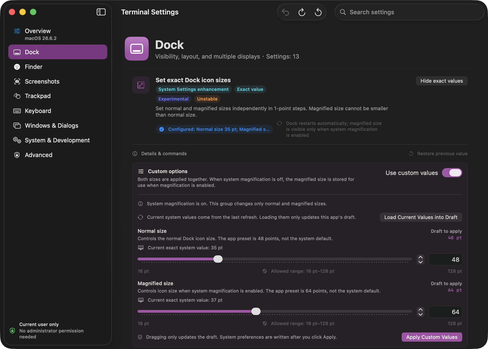

# Terminal Settings

Bring macOS preferences usually adjusted with Terminal commands into a native interface with explanations, command previews, and recovery options. This app manages system preferences; it is not a settings editor for Terminal.app.

[简体中文](README.zh-CN.md) · [Download preview](https://github.com/muyuzy123-pixel/macos-terminal-settings/releases/tag/v1.9.0-preview.1) · [Contributing](CONTRIBUTING.md) · [Security](SECURITY.md)

**Current preview:** `v1.9.0-preview.1` · App **1.9.0 (Build 17)** · [MIT license](LICENSE)

See [release status](docs/RELEASE_STATUS.md) for distribution status and verified scope.



*English interface captured at native 2× resolution in an isolated preview copy. The 48/64-point drafts have not been applied; current system values remain 35/37 points.*

## What you can change

The app includes **40 settings across 8 categories**, with **7 numeric control groups and 10 parameters**.

| Category | Settings | Examples |
| --- | ---: | --- |
| Dock | 13 | Icon sizes, animation timing, multi-display behavior |
| Finder | 6 | Window title paths, network and USB metadata preferences |
| Screenshots | 4 | Image format, window shadows, file names |
| Trackpad | 1 | Experimental legacy three-finger double-tap preference |
| Keyboard | 2 | Key repeat rate and press-and-hold behavior |
| Windows & dialogs | 7 | Window animations and expanded save dialogs |
| System & development | 4 | Menu bar spacing and screen saver idle time |
| Advanced | 3 | Supported power wake and keep-awake flags |

- **See what will change.** View current values, descriptions, risk labels, sources, and equivalent commands.
- **Edit precise values.** Keep numeric drafts separate from the current system value; review the submission paths described below.
- **Work in either language.** Switch between English and Simplified Chinese immediately; search in either language or by preference key. Numbers follow the system region.
- **Undo and recover.** The app records values before changing them and checks management restrictions and external edits before restoring them.

The catalog distinguishes **34 Terminal-only settings**, **4 System Settings enhancements**, and **2 mirrors**. Some preferences are undocumented or experimental. Availability and effects vary by macOS version; a successful write/read-back confirms the stored value, not its visible effect.

## Download and install

| Requirement | Current support |
| --- | --- |
| Hardware | Apple silicon (`arm64`); no Intel build is supplied |
| Deployment target | macOS 14.0 or later; individual features may require a newer version |
| Local validation | macOS 26.6.2; real-device macOS 14 acceptance is still outstanding |
| Distribution | Preview build, ad-hoc signed with Hardened Runtime; no Developer ID or notarization |

Local checks cover contracts, isolated integration, builds, and archive verification. They do not establish that all UI effects or real administrator writes have been accepted on a device; see [testing](docs/TESTING.md) and [release status](docs/RELEASE_STATUS.md).

1. Open the [preview release](https://github.com/muyuzy123-pixel/macos-terminal-settings/releases/tag/v1.9.0-preview.1) and download `TerminalSettings.zip` and `SHA256SUMS` from **Assets**. The release also includes `release-manifest.json` with build and verification details.
2. In the folder containing both downloaded files, verify the archive:

   ```sh
   shasum -a 256 -c SHA256SUMS
   ```

   The expected result is `TerminalSettings.zip: OK`. If verification fails, stop installation and download both files again from the same release; [report the problem](https://github.com/muyuzy123-pixel/macos-terminal-settings/issues/new?template=bug_report.md) if it persists.
3. Quit any older copy, extract the ZIP, and move `TerminalSettings.app` to Applications before opening it.

This preview is **not notarized**, so macOS may block it. Review [Apple's guidance on opening downloaded apps](https://support.apple.com/en-us/102445) and the project's [security boundaries](SECURITY.md) before deciding to run it. A matching checksum confirms the downloaded file matches the release; it does not establish that the software is safe.

## Using the app

Choose **语言 / Language** in Overview to follow the system language, use Simplified Chinese, or use English. Browse a category or search for a setting, then read its effect, compatibility notes, and command preview.

**Numeric edits update drafts first.** Expanding an editor, moving a slider, typing a value, selecting a draft preset, or loading the current value does not by itself change system preferences. **Apply** buttons submit changes; **turning on the corresponding feature may also apply the selected custom draft**. Numeric drafts and editing modes are retained between launches.

**Main feature switches and menus that directly select system values execute changes when operated**—for example, Dock alignment and screenshot file format. Language selection, draft presets, and the custom-editing mode switch only update app state or drafts. Some changes restart Dock or Finder; advanced actions require confirmation and administrator authorization. Follow the effect and restart information shown for the setting.

Recovery actions have distinct meanings:

| Action | What it does |
| --- | --- |
| Undo last change | Restores the preceding transaction's snapshot, subject to management and conflict checks |
| Delete current explicit value | When checks allow, removes the current override, including one originally set by another tool; the system then resolves the effective value. This is not a factory reset and does not bypass management restrictions |
| Restore pre-app value | Restores the recorded value or absence from before the app first took control; restoration is blocked when an external change is detected |

Advanced power settings have no guessed factory-default reset: switching one off writes `0`, while Undo uses the previous per-power-source snapshot. Items with managed, unreadable, conflicting, or unresolved recovery state may remain read-only.

Deleting `TerminalSettings.app` does not automatically undo applied settings or clear the app’s local preferences and recovery records. To revert changes, first use the available Undo or per-setting recovery actions. Keep recovery data while a transaction is unresolved; deleting its journal does not safely resolve it.

## Permissions and local data

Ordinary settings use the current user's preferences, including current-host domains where required. Advanced actions allow only three `pmset` Boolean keys: `ttyskeepawake`, `proximitywake`, and `acwake`.

The app requests no Accessibility, Screen Recording, Automation, Full Disk Access, or Input Monitoring permissions. There is no telemetry, network client, or automatic updater in the app; reference links open in the system browser.

Language choice, numeric drafts, and per-setting recovery baselines live in the app's preferences. The last-undo file and pending transaction journal live in its local Application Support directory. The bundle identifier remains `com.codex.TerminalSettings` for record compatibility.

The advanced authorization bridge currently uses the deprecated `AuthorizationExecuteWithPrivileges` API. A modern signed helper remains future work. See [SECURITY.md](SECURITY.md) for this and other limitations.

## Build from source

Use an Apple silicon Mac with Xcode or Apple Command Line Tools providing a **macOS 26.x SDK**. The app uses SwiftUI and other Apple system frameworks, Swift 5 language mode, and no third-party package dependencies. Clone the repository, then run:

```sh
git clone https://github.com/muyuzy123-pixel/macos-terminal-settings.git
cd macos-terminal-settings
zsh build.sh
```

These commands build the current default branch. To build the source for this preview instead, run `git switch --detach v1.9.0-preview.1` after cloning and **before** `zsh build.sh`. Building the same tag is not a guarantee of a byte-identical ZIP.

The build creates `TerminalSettings.app` and `TerminalSettings.zip`. If it fails, check the toolchain requirements above and the [contributor guidance](CONTRIBUTING.md); include the error and toolchain version in a redacted bug report. To check contracts and independently verify the packaged archive:

```sh
zsh verify.sh --contract-only
zsh scripts/check-release.sh
```

The release check writes the verified ZIP, checksum, and manifest to `dist/`. Build scripts accept `DEVELOPER_DIR` and `SDKROOT`; otherwise they prefer installed Command Line Tools. Paths containing spaces are supported.

Full integration checks use isolated test preference domains and read live power settings; see [testing](docs/TESTING.md) before running `zsh verify.sh`. CI runs contract, build, and archive checks—view the result for a specific commit in [GitHub Actions](https://github.com/muyuzy123-pixel/macos-terminal-settings/actions).

## Project documentation

- [Contributing](CONTRIBUTING.md): implementation rules and how to propose changes.
- [Testing](docs/TESTING.md) and [release status](docs/RELEASE_STATUS.md): what has been checked and what remains unverified.
- [Release procedure](docs/RELEASING.md): packaging, signing, and distribution scope.
- [Sources and attribution](docs/ATTRIBUTION.md) and [baseline hashes](docs/upstream-baseline.json): reference material and imported source provenance.
- [Report a bug](https://github.com/muyuzy123-pixel/macos-terminal-settings/issues/new?template=bug_report.md): include the app/macOS versions and a minimal, redacted reproduction. Keep preference exports and recovery files private.

## License

[MIT](LICENSE) · Copyright © 2026 muyuzy123-pixel. The license notice is included in the app bundle.
