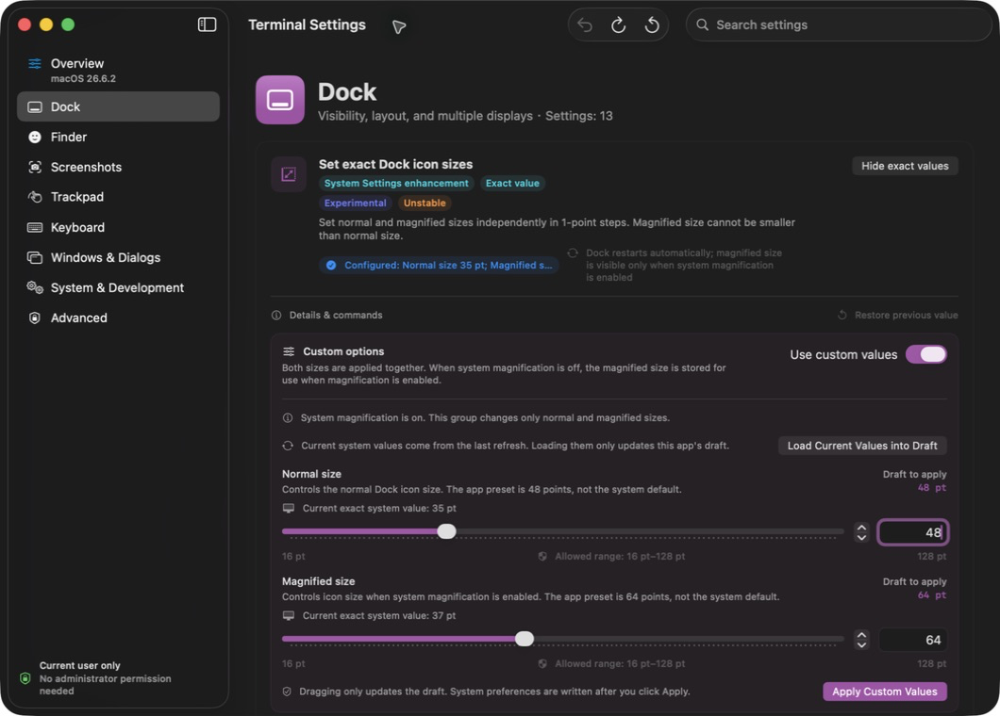

# 终端设置 · Terminal Settings

把通常需要终端命令调整的 macOS 系统偏好，集中到带有作用说明、命令预览和恢复支持的原生界面。它管理系统偏好，不是 Terminal.app 自身的设置编辑器。

[English](README.md) · [下载预览版](https://github.com/muyuzy123-pixel/macos-terminal-settings/releases/tag/v1.9.0-preview.1) · [参与贡献](CONTRIBUTING.md) · [安全说明](SECURITY.md)

**当前预览版：** `v1.9.0-preview.1` · 应用 **1.9.0（Build 17）** · [MIT 许可](LICENSE)

当前分发状态与已验证范围见[发布状态](docs/RELEASE_STATUS.md)。



*隔离预览副本的真实界面：48/64 点为尚未应用的草稿，系统当前值仍为 35/37 点。*

## 可以调整什么

应用包含 **8 个分类、40 项设置**，其中有 **7 组数值控件、10 个参数**。

| 分类 | 项数 | 功能示例 |
| --- | ---: | --- |
| 程序坞 | 13 | 图标尺寸、动画时间、多显示器行为 |
| 访达 | 6 | 窗口标题路径、网络与 USB 磁盘元数据偏好 |
| 截屏 | 4 | 图片格式、窗口阴影、文件名 |
| 触控板 | 1 | 实验性的旧版三指双击偏好 |
| 键盘 | 2 | 按键重复速度、长按行为 |
| 窗口与对话框 | 7 | 窗口动画、展开保存对话框 |
| 系统与开发 | 4 | 菜单栏间距、屏保闲置时间 |
| 高级 | 3 | 设备支持的电源唤醒与保持唤醒选项 |

- **看清设置再操作。** 查看系统当前值、作用、风险标记、依据和等价命令。
- **精确编辑数值。** 系统当前值与数值草稿分开显示，具体提交入口见下方「基本使用」。
- **中英文即时切换。** 支持双语及偏好键名搜索；数字格式遵循系统区域。
- **保留恢复依据。** 记录更改前的值，恢复前检查组织管理限制和外部修改，支持撤销与中断后的恢复。

当前目录区分 **34 项「仅终端」**、**4 项「系统设置增强」**和 **2 项「系统设置镜像」**。部分偏好未公开或具有实验性，是否可用、是否产生实际效果取决于 macOS 版本；写入后读回成功只证明存储值正确，不代表可见效果已经生效。

## 下载与安装

| 要求 | 当前支持情况 |
| --- | --- |
| 硬件 | Apple 芯片（`arm64`），暂不提供 Intel 构建 |
| 最低部署目标 | macOS 14.0；个别功能可能要求更高系统版本 |
| 本机验证环境 | macOS 26.6.2；尚未完成真实 macOS 14 设备验收 |
| 分发状态 | 预览版，Hardened Runtime + ad-hoc 签名；无 Developer ID 签名与 Apple 公证 |

本轮本地验证覆盖契约检查、隔离集成测试、构建和归档核验，不代表所有界面效果或真实管理员写入均已完成实机验收；完整范围见[测试说明](docs/TESTING.md)和[发布状态](docs/RELEASE_STATUS.md)。

1. 打开[预览版发布页](https://github.com/muyuzy123-pixel/macos-terminal-settings/releases/tag/v1.9.0-preview.1)，从 **Assets** 下载 `TerminalSettings.zip` 和 `SHA256SUMS`。发布页另附 `release-manifest.json`，记录构建与核验信息。
2. 在这两个文件所在的文件夹中校验安装包：

   ```sh
   shasum -a 256 -c SHA256SUMS
   ```

   预期结果为 `TerminalSettings.zip: OK`。校验失败时停止安装，从同一发布页重新下载这两个文件；若仍失败，请[反馈问题](https://github.com/muyuzy123-pixel/macos-terminal-settings/issues/new?template=bug_report.md)。
3. 退出旧版应用，解压 ZIP，将 `TerminalSettings.app` 移到「应用程序」后打开。

当前预览版**未经过公证**，macOS 可能阻止启动。请先阅读 [Apple 关于安全打开 App 的说明](https://support.apple.com/zh-cn/102445)和项目的[安全边界](SECURITY.md)，再决定是否运行。校验和一致只说明下载文件与发布文件一致，不等同于软件安全认证。

## 基本使用

在概览中通过 **语言 / Language** 选择跟随系统、简体中文或 English。进入分类或搜索功能后，先查看作用、兼容说明和命令预览。

**数值编辑先更新草稿。** 展开编辑器、拖动滑块、输入数值、选择草稿预设或载入当前值，本身不会更改系统偏好。点击**应用自定义值**、**应用安全／常用预设**等按钮会提交更改；**开启对应功能时，也可能提交当前选中的自定义草稿**。数值草稿与编辑模式会在下次启动时保留。

**主功能开关，以及用于直接选择系统设置值的菜单，会在操作时执行更改**，例如「程序坞对齐位置」「截屏文件格式」。语言选择、草稿预设和自定义编辑模式开关只更新应用状态或草稿。部分更改会重启 Dock 或 Finder，高级操作需要确认并请求管理员授权；具体影响与生效方式以该设置项显示的说明为准。

不同恢复操作的含义如下：

| 操作 | 实际行为 |
| --- | --- |
| 撤销上次更改 | 通过管理状态与冲突检查后，恢复上一笔事务之前的快照 |
| 删除当前显式值 | 在检查允许时删除当前覆盖值，可能包括其他工具写入的值；随后由系统重新解析有效值。这不等同于恢复出厂设置，也不会绕过组织管理限制 |
| 恢复接管前值 | 恢复本应用首次接管前保存的精确值或缺失状态；检测到外部修改时不会覆盖 |

高级电源项不猜测「出厂默认值」：关闭时明确写入 `0`，撤销则使用操作前各电源来源的快照。存在组织管理、读取失败、外部冲突或未解决恢复状态时，相关项目可能保持只读。

删除 `TerminalSettings.app` 不会自动撤销已应用的设置，也不会由本应用清除本地偏好和恢复记录。若希望还原，请先使用可用的撤销或逐项恢复功能；仍有未完成事务时应保留恢复数据，直接删除日志并不能安全地解决问题。

## 权限与本地数据

普通功能操作当前用户偏好，必要时使用当前主机作用域。高级功能只允许 `ttyskeepawake`、`proximitywake`、`acwake` 三个 `pmset` 布尔键。

应用不请求辅助功能、屏幕录制、自动化、完全磁盘访问或输入监控权限。应用中没有遥测、网络客户端或自动更新服务，参考链接由系统浏览器打开。

语言、数值草稿和逐项接管前恢复基线保存在应用偏好中；上次撤销文件与待恢复事务日志保存在本机 Application Support。Bundle ID 保持为 `com.codex.TerminalSettings`，以兼容已有记录。

高级权限桥目前仍使用已弃用的 `AuthorizationExecuteWithPrivileges` API，迁移现代签名 helper 属于后续工作。相关限制见 [SECURITY.md](SECURITY.md)。

## 从源码构建

需要 Apple 芯片 Mac，以及提供 **macOS 26.x SDK** 的 Xcode 或 Apple Command Line Tools。项目使用 SwiftUI 等 Apple 系统框架、Swift 5 语言模式，无第三方包依赖。克隆仓库后执行：

```sh
git clone https://github.com/muyuzy123-pixel/macos-terminal-settings.git
cd macos-terminal-settings
zsh build.sh
```

上述命令构建默认分支的当前源码。如需构建本页预览版对应的源码，请在克隆后、执行 `zsh build.sh` **之前**运行 `git switch --detach v1.9.0-preview.1`。检出同一标签不代表生成的 ZIP 校验和必然相同。

构建生成 `TerminalSettings.app` 和 `TerminalSettings.zip`。构建失败时先核对上述工具链要求和[贡献说明](CONTRIBUTING.md)，反馈时附上已脱敏的错误与工具链版本。运行契约测试与独立解包核验：

```sh
zsh verify.sh --contract-only
zsh scripts/check-release.sh
```

发布核验会将已验证的 ZIP、校验和与清单写入 `dist/`。构建脚本支持 `DEVELOPER_DIR`、`SDKROOT`，默认优先使用已安装的 Command Line Tools，并支持包含空格的源码路径。

完整集成测试会使用隔离测试偏好域并只读访问实际电源设置；执行 `zsh verify.sh` 前请阅读[测试说明](docs/TESTING.md)。CI 包含契约测试、构建和安装包核验，具体提交的运行结果见 [GitHub Actions](https://github.com/muyuzy123-pixel/macos-terminal-settings/actions)。

## 项目文档

- [贡献约定](CONTRIBUTING.md)：实现约束与改动提交流程。
- [测试说明](docs/TESTING.md)与[发布状态](docs/RELEASE_STATUS.md)：已核验内容及尚未覆盖的范围。
- [发布流程](docs/RELEASING.md)：打包、签名与分发范围。
- [来源说明](docs/ATTRIBUTION.md)与[基线哈希](docs/upstream-baseline.json)：参考资料和导入源码记录。
- [反馈问题](https://github.com/muyuzy123-pixel/macos-terminal-settings/issues/new?template=bug_report.md)：提供应用与系统版本、最小复现步骤和已脱敏的必要信息，勿上传完整偏好导出或恢复文件。

## 许可证

[MIT](LICENSE) · Copyright © 2026 muyuzy123-pixel。应用安装包中包含相同许可声明。
